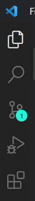
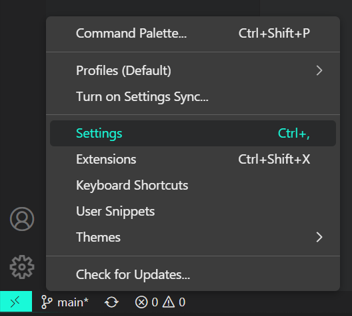
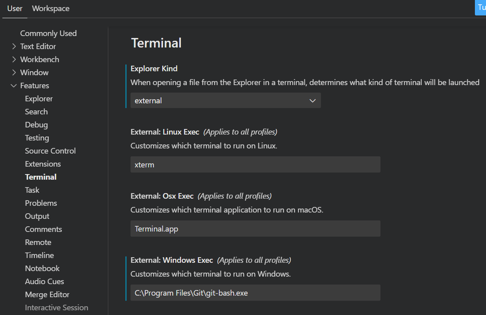

# Setting up VScode for ruby development

## Installation

[Download Here](https://code.visualstudio.com/Download)

## VScode basics

1. **Explorer** - Displays all files and folders in the current working directory.
2. **Search** - Used for basic searching actions. Mainly unused due to the VIM extension.
3. **Source Control** - For all Git-related actions.
4. **Run and Debug** - Can be used to debug your program; however, requires some setup depending on what language you are using.
5. **Extensions** - This is where you will go to add your extensions, the process is very simple.

## Notable Settings

Cog -> Settings

- You have the ability to right click a file in the explorer and open in terminal. This setting determines if you want to use an external terminal or the internal one within VScode. (both of these locations can be configured)
- Integrated terminal settings can be found just below. 

### Settings.json

1. `Ctrl + Shift + p`
2. Search for settings.json
3. Click on open user settings.json

This file is important and contains all of your settings. Settings can be added by directly editing this file instead of using the settings interface.

## Extensions

Click extensions in the activity bar, search for the extension, click install. It's that simple.

The following are extensions I recommend:

### Functionality

- **Vim** - Adds Vim emulation.
- **Ruby extension pack** - Contains 8 ruby extensions:
  - Ruby
  - Ruby Solargraph
  - ruby-rubocop
  - Ruby Language Colorization
  - Ruby Haml
  - Simple Ruby ERB
  - ruby-linter
  - ruby-symbols
- **VSCode Ruby** - Syntax highlighting, snippet, and language config support.
- **Rails** - RoR support.
- **HTML CSS Support** - Intellisense with auto completion.
- **Prettier** - Formatter.
- **React Native Tools** - Useful dev environment tools.
- **ES7+ React/Redux/React-Native snippets** - Contains useful snippets to quickly generate boiler code. e.g. "rafc" + tab -> react arrow function component.
- **Better Comments** - Helps you create more human-friendly comments.
- **Code Spell Checker** - Spelling Checker.
- **Docker** - Create, manage, and debug apps.
- **ESLint** - Integrates ESLint into VScode.
- **IntelliCode** - AI-assisted development features in VScode.
- **GitLens** - Powerful, feature-rich extension with multiple useful Git features.
- **Highlight Matching Tag** - Highlights matching opening/closing tags
- **Atom Keymap** - Ports popular Atom keyboard shorts to VScode.

### Appearance

- **Material Icon Theme** - Provides nice icons for your files/folders in the explorer.
- **Atom One Dark Theme** - One dark theme based on Atom.
